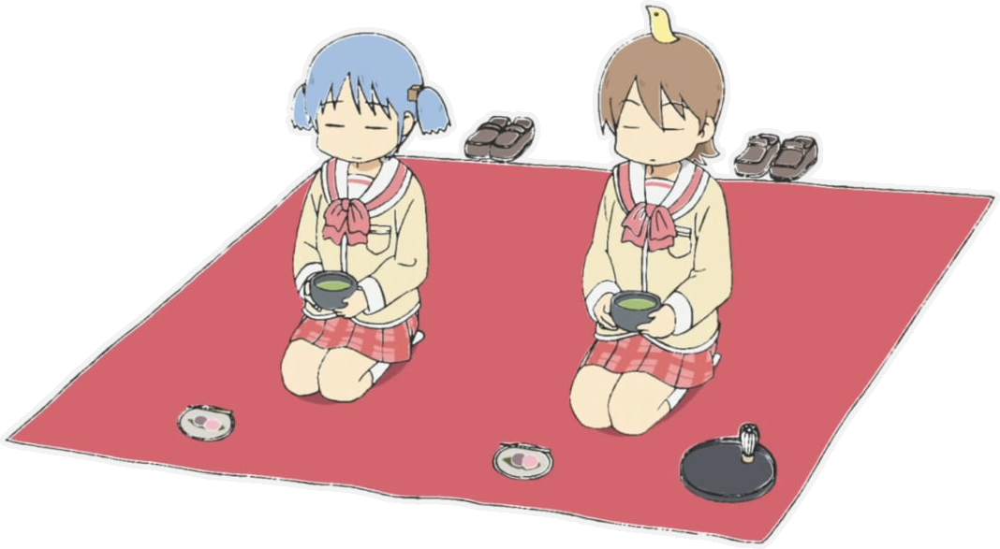

&nbsp;&nbsp;&nbsp;&nbsp;&nbsp;

  
<b>About me</b>

   

  

> **I am a programmer. Interested in Game Development, Game Design, Software Architecture, Data Structures and Computer Graphics. Creating my own games here and on itch.io. For Game Jams too!**

  
* **Name: Maxim Kozyavin**
* **Nickname: Kanzu or Kanzu32**
* **Location: Russia, Kursk**
* **Current tech stack:**

           

  
<b>Skills</b>

   

  
   
   
   
   
   
   
   
   
   
   
   
   
   
   
   
   
   
   

  
<b>Achievements</b>

   
  
* «Mini Jam 200: Freedom»: 120 hours gamejam, [Top 5 Rocks I Want To Find While Digging Around](https://kanzu32.itch.io/top-5-rocks-i-want-to-find-while-digging-around), 56/110
* «Mini Jam 195: Forge»: 72 hours gamejam, [Quacky Business](https://kanzu32.itch.io/quacky-business), 12/47
* ICPC NERC Southern and Volga Russia Qualifier: 3-5 solved problems, reaching the finals (2021-2024)
* Hackathon BEST Hack: Reaching the finals, [Gas-station data aggregator server](https://github.com/Kanzu32/FinalBestHack-2022-Kanzu) (2022)
* RuCode: Finalist in the track «Algorithmic Programming» (2022)

  
<b>Education</b>

   
  
🎓 **Kursk State University**, Faculty of Physics, Mathematics and Computer Science (2021-2025)
- Specialty: Software Engineering and Information Systems Management
- Area of study: Information Systems and Database Design
- Diploma Thesis: Game [Troublemakers](https://github.com/Kanzu32/strategy-game) using self-written [ECS architectural pattern](https://github.com/Kanzu32/go-ecs) in Go language.

📚 **Additional education**
* Samsung IT Academy: “Mobile Development», [FliBook](https://github.com/Kanzu32/FliBook) (2022)
* RuCode_5.0: «Intensive Programming: Advanced Algorithms» (2022)
* RuCode_4.0: «Intensive Programming» (2021)

  
<b>Projects</b>

  ## [Top 5 Rocks I Want To Find While Digging Around (Itch.io)](https://kanzu32.itch.io/top-5-rocks-i-want-to-find-while-digging-around)

**Surreal absurd optimistic pessimistic phantasmagoric chaotic story about rocks made in 120 hours with <ins>*Unity*</ins>. It's a Minesweeper-like game where you need to dig to find rocks from your wishlist and hang out with your friends showing them your rocks!!**

|  |  |
| --- | --- |

  ## [Quacky Business (Itch.io)](https://kanzu32.itch.io/quacky-business)
  
**Strategic shopkeeper game made in 72 hours with <ins>*Unity*</ins> where player needs to find a balance between profit and the war of heroes and monsters by selling the strangest weapons in the world!**

|  |  |
| --- | --- |

| **<h3>[Multiplayer shooter (GitHub)](https://github.com/Kanzu32/2D-Multiplayer-Shooter)</h3> Client-hosted game made with <ins>*Unity*</ins>, <ins>*Netcode for GameObjects*</ins> and <ins>*Relay*</ins>.** |  |
| :---: | --- |
| **<h3>[Third person Action Platformer (GitHub)](https://github.com/Kanzu32/3D-Platformer)</h3> Third person platformer with enemies, combo-attacks and guard mechanics. Made using <ins>*Unity*</ins>.** |  |
| **<h3>[Troublemakers! / Смутьяны! (GitHub)](https://github.com/Kanzu32/strategy-game)</h3> Client-server turn-based strategy game "Troublemakers" made in <ins>*Go*</ins> and <ins>*Ebitengine*</ins>. Uses [self-writen implementation](https://github.com/Kanzu32/go-ecs) of the Enity-Component-System architectural pattern.** |  |
| **<h3>[Pacman (GitHub)](https://github.com/Kanzu32/pacman)</h3> Clone of the PacMan written in <ins>*C++*</ins> and <ins>*Qt*</ins>. Has two players and solo mode, difficulty levels, music player, leaderboards, controll settings, levels in txt format and other features.** |  |
| <h3>And more projects made with <ins>*Godot*</ins>, <ins>*BlockBench*</ins>, <ins>*Unity*</ins> and other tools.</h3>|  |

